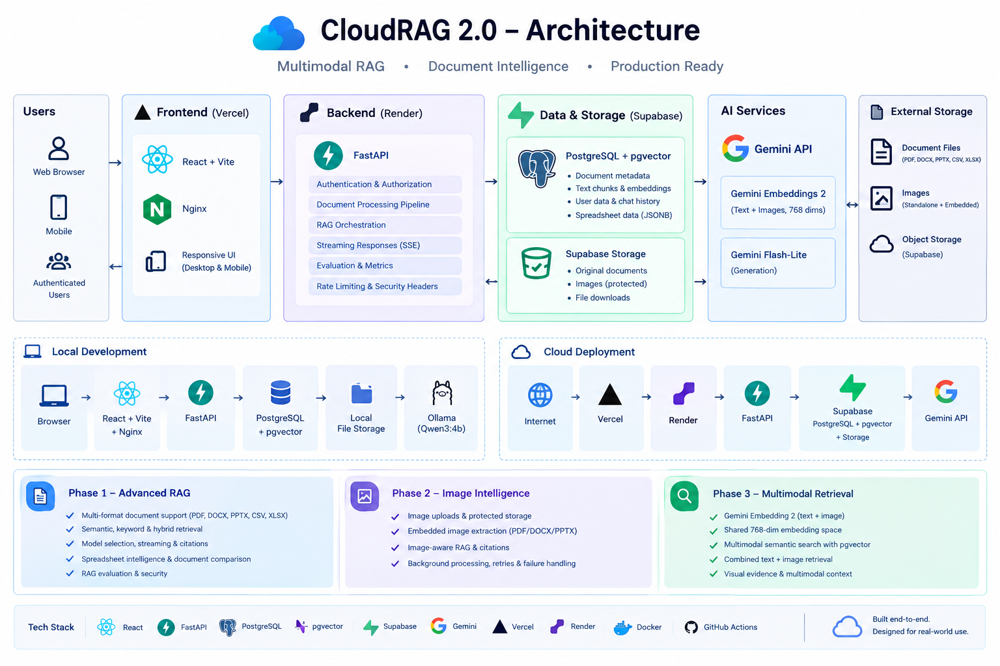

# CloudRAG 2.0 — Production-Style Document Intelligence & Multimodal RAG

CloudRAG 2.0 is a full-stack **Retrieval-Augmented Generation (RAG)** platform for grounded document question answering, spreadsheet intelligence, document comparison, image intelligence, multimodal retrieval, evaluation, and secure cloud deployment.

The project evolved through three phases:

- **Phase 1 — Advanced RAG & AI application engineering**
- **Phase 2 — Image intelligence**
- **Phase 3 — Multimodal retrieval**

The result is a production-style AI application rather than a simple LLM demo, with authentication, user-level data ownership, persistent storage, background ingestion, interactive citations, streaming responses, evaluation tooling, security controls, observability, image-aware RAG, and multimodal vector search.

## Live Demo

**Frontend:** https://cloudrag-v2-eta.vercel.app/

The public deployment runs independently of the local development machine.

## Architecture



## What CloudRAG 2.0 Supports

### Phase 1 — Advanced RAG

- PDF, DOCX, PPTX, CSV and XLSX document processing
- Semantic retrieval
- Keyword retrieval
- Hybrid retrieval
- User-scoped and document-scoped retrieval
- Multiple Gemini model selection
- Streaming RAG responses using SSE
- Persistent chat sessions and history
- Interactive source citations
- Evidence-based document comparison
- Spreadsheet intelligence with structured row storage
- Deterministic spreadsheet filtering and calculations
- RAG evaluation and latency measurement
- Authentication and user-level data ownership
- Rate limiting and security headers
- Health/readiness endpoints
- Prometheus metrics

### Phase 2 — Image Intelligence

- Standalone image uploads
- Protected image storage
- Image analysis and visual descriptions
- Image-aware RAG
- Image citations and previews
- Embedded image extraction from PDF, DOCX and PPTX
- Persistent image metadata
- Background processing
- Processing progress and failure tracking
- Retry support
- Multiple embedded images per document

### Phase 3 — Multimodal Retrieval

Phase 3 extends image intelligence into **multimodal semantic retrieval**.

CloudRAG uses **Gemini Embedding 2** to generate embeddings for both text and images in a shared **768-dimensional vector space**.

This enables:

- Text embeddings and image embeddings
- Image vector storage in PostgreSQL + pgvector
- Multimodal similarity search
- Combined text + visual candidate retrieval
- Unified candidate ranking
- Visual evidence retrieval
- Multimodal context construction
- Retrieval of the original protected image for visual reasoning
- Multimodal evidence supplied to the Gemini generation model
- Reindexing support for existing images
- Automatic embedding of newly ingested images

The resulting retrieval flow is:

```text
Question
   ↓
Gemini Embedding 2
   ↓
┌─────────────────────────────┐
│ Text vector search          │
│ Image vector search         │
└──────────────┬──────────────┘
               ↓
      Combined candidate pool
               ↓
         Final evidence
               ↓
      Multimodal Gemini RAG
               ↓
        Grounded response
```

## Key Features

| Area | Capabilities |
|---|---|
| RAG | Semantic, keyword and hybrid retrieval |
| Documents | PDF, DOCX, PPTX, CSV and XLSX |
| Images | Standalone and embedded image intelligence |
| Multimodal AI | Shared text/image embeddings and visual retrieval |
| LLMs | Gemini model selection and streaming generation |
| Citations | Interactive source and visual evidence citations |
| Spreadsheets | Structured rows, filtering and deterministic calculations |
| Comparison | Evidence-based comparison of two documents |
| Evaluation | Hit rate, reference coverage, exact match, average latency and p95 latency |
| Security | JWT authentication, ownership checks, rate limits, upload limits and security headers |
| Storage | Original documents and protected images |
| Reliability | Background ingestion, progress tracking, retries and failure handling |
| Observability | Health/readiness endpoints and Prometheus metrics |
| Deployment | Vercel + Render + Supabase + Gemini |
| Development | Local Docker/PostgreSQL + host Ollama workflow |

## Technology Stack

### Frontend

- React
- Vite
- Nginx
- Responsive desktop/mobile UI

### Backend

- Python
- FastAPI
- Uvicorn
- JWT authentication
- Server-Sent Events (SSE)
- Background document processing

### Data & Retrieval

- PostgreSQL
- pgvector
- Vector embeddings
- Hybrid retrieval
- User-scoped document/chunk retrieval
- Structured spreadsheet rows
- Multimodal image embeddings

### AI

**Local development**
- Ollama
- Qwen3:4b

**Cloud**
- Google Gemini API
- Gemini Embedding 2
- Gemini Flash-Lite / supported Gemini generation models

### Cloud Infrastructure

- Vercel — frontend hosting
- Render — backend hosting
- Supabase — PostgreSQL, pgvector and private object storage
- Google Gemini API — cloud embeddings and generation

### Development & Testing

- Docker
- Docker Compose
- Pytest
- GitHub Actions

## Core Pipelines

### Document RAG Pipeline

```text
Upload
  ↓
Persistent document record
  ↓
Original file storage
  ↓
Parsing
  ↓
Text extraction
  ↓
Chunking
  ↓
Embedding generation
  ↓
PostgreSQL + pgvector
  ↓
Hybrid / semantic retrieval
  ↓
Evidence selection
  ↓
Gemini generation
  ↓
Citations + persisted chat history
```

### Spreadsheet Intelligence

```text
Excel / CSV
  ↓
Typed row extraction
  ↓
Structured JSONB rows
  ↓
Filtering / deterministic calculations
  ↓
Result rows used as evidence
  ↓
Grounded answer
```

### Image Intelligence

```text
Image upload
     ↓
Protected storage
     ↓
Image analysis
     ↓
Visual description
     ↓
Image metadata
     ↓
Image-aware RAG
```

### Embedded Images

```text
PDF / DOCX / PPTX
        ↓
Embedded image extraction
        ↓
Protected image storage
        ↓
Visual description
        ↓
Gemini Embedding 2
        ↓
768-dim pgvector embedding
```

### Multimodal Retrieval

```text
User question
      ↓
Gemini Embedding 2
      ↓
 ┌───────────────┬────────────────┐
 │ Text search   │ Image search   │
 └───────┬───────┴────────┬───────┘
         └───────┬────────┘
                 ↓
       Combined candidate pool
                 ↓
          Final evidence
                 ↓
       Multimodal Gemini RAG
                 ↓
        Grounded answer + citations
```

## Security

CloudRAG includes:

- JWT authentication
- Per-user document ownership
- Per-user chat/session ownership
- Protected document downloads
- Protected image access
- Protected search and answer endpoints
- Upload size limits
- Sliding-window rate limiting
- Separate limits for authentication, search, chat, comparison and uploads
- `429 Too Many Requests` responses with `Retry-After`
- `413 Payload Too Large` for oversized uploads
- `X-Content-Type-Options`
- `X-Frame-Options`
- `Referrer-Policy`
- `Permissions-Policy`
- HSTS in production
- Secrets kept outside the repository

## API Surface

Representative endpoint groups include:

```text
/auth/register
/auth/login
/auth/me

/documents
/documents/{id}
/documents/{id}/download
/documents/{id}/retry
/documents/compare

/search
/ask
/ask/stream

/multimodal/reindex

/evaluation/*
/health
/live
/ready
/metrics
```

Swagger/OpenAPI is available from the FastAPI deployment at:

```text
/docs
```

## RAG Evaluation

The evaluation panel supports small, repeatable test sets and reports:

- Retrieval hit rate
- Reference-answer coverage
- Exact-match rate
- Average latency
- p95 latency
- Individual test-case results
- Generated answers

Evaluation is intentionally lightweight and does not require a separate LLM judge.

## Local Development

CloudRAG keeps the local development workflow separate from the production cloud architecture.

During active RAG development:

```text
Docker Compose
├── PostgreSQL + pgvector
└── React frontend

Windows host
├── FastAPI backend (.venv)
└── Ollama → Qwen3:4b
```

The backend is intentionally run from the local Python environment during active development to avoid repeatedly rebuilding a backend image containing large ML dependencies.

### Requirements

- Docker Desktop
- Python 3.14+
- Ollama
- Qwen3:4b

### Start PostgreSQL and frontend

Because the FastAPI backend is intentionally run directly from the local Python environment during active development, start the database and frontend without starting the backend Compose service:

```powershell
docker compose up postgres
docker compose up frontend --no-deps
```

### Start Ollama

```powershell
ollama pull qwen3:4b
ollama serve
```

### Start FastAPI

From the project root, activate the project virtual environment and start FastAPI using the development configuration.

Typical local services:

```text
Frontend: http://localhost:5173
Backend:  http://localhost:8000
Swagger:  http://localhost:8000/docs
PostgreSQL: localhost:5432
Ollama:   http://localhost:11434
```

### Final backend containerization

The backend will be containerized for the final project/deployment state rather than rebuilt repeatedly during active RAG development.

## Cloud Deployment

The production architecture uses:

```text
Vercel
  └── React/Vite frontend

Render
  └── FastAPI backend

Supabase
  ├── PostgreSQL + pgvector
  └── Private document/image storage

Google Gemini
  ├── Gemini Embedding 2
  └── Gemini generation
```

Required production configuration includes:

```text
DATABASE_URL
JWT_SECRET_KEY
FRONTEND_URL
SUPABASE_URL
SUPABASE_SERVICE_ROLE_KEY
SUPABASE_STORAGE_BUCKET
GEMINI_API_KEY
GEMINI_MODEL
GEMINI_EMBEDDING_MODEL
GEMINI_API_BASE_URL
STORAGE_BACKEND
```

Secrets must be configured in the hosting provider rather than committed to Git.

## Database Migrations

The project uses incremental PostgreSQL migrations.

Important milestones include:

```text
001_initial_schema.sql
002_chat_sessions.sql
003_users_and_ownership.sql
004_document_storage.sql
005_ingestion_progress.sql
006_interactive_citations.sql
007_spreadsheet_rows.sql
008_multi_model_support.sql
009_image_intelligence.sql
010_embedded_document_images.sql
011_multimodal_embeddings.sql
```

The Phase 3 migration adds 768-dimensional image embeddings and pgvector indexing for multimodal retrieval.

## Project Structure

```text
cloudrag/
├── backend/
│   ├── main.py
│   ├── config.py
│   ├── auth.py
│   ├── security.py
│   ├── database.py
│   ├── ingestion.py
│   ├── chunking.py
│   ├── document_parser.py
│   ├── embedding.py
│   ├── image_intelligence.py
│   ├── llm.py
│   ├── rag.py
│   ├── comparison.py
│   ├── metrics.py
│   ├── models.py
│   ├── repositories/
│   └── migrations/
├── frontend/
├── tests/
├── docs/
├── .github/workflows/
├── compose.yaml
├── pyproject.toml
└── README.md
```

## Verification

The project has been verified progressively with:

- Python compilation checks
- Focused unit tests
- Authentication testing
- Upload and download testing
- Ingestion failure/retry testing
- Citation persistence testing
- Spreadsheet calculation testing
- RAG evaluation testing
- Rate-limit testing
- Upload-size testing
- Security-header testing
- Streaming response testing
- Document comparison testing
- Image intelligence testing
- Embedded image extraction testing
- Multimodal retrieval testing
- Multimodal reasoning testing
- Cloud deployment verification
- Mobile UI verification

## Engineering Principles

A major design goal is to keep deterministic application logic separate from generative AI behavior.

For example:

- File ownership is enforced by the application and database queries.
- Spreadsheet filtering and arithmetic are deterministic.
- Retrieval produces explicit evidence.
- Image retrieval produces explicit visual evidence.
- The LLM is responsible for natural-language synthesis rather than silently inventing application state.
- Citations are persisted with assistant messages.
- Protected files and images remain behind application-controlled access.
- Local and cloud inference are separated behind the application layer.

This makes the system easier to test, debug and deploy.

## Project Outcome

CloudRAG 2.0 progressed from a text-focused RAG application into a broader **document intelligence and multimodal AI engineering project**.

The final system brings together:

**RAG + Vector Search + Document Intelligence + Spreadsheet Intelligence + Image Intelligence + Multimodal Retrieval + LLMs + Security + Evaluation + Cloud Deployment**

The project was built to understand the engineering surrounding modern AI systems, not simply the model call itself.

## License

CloudRAG is licensed under the MIT License.
